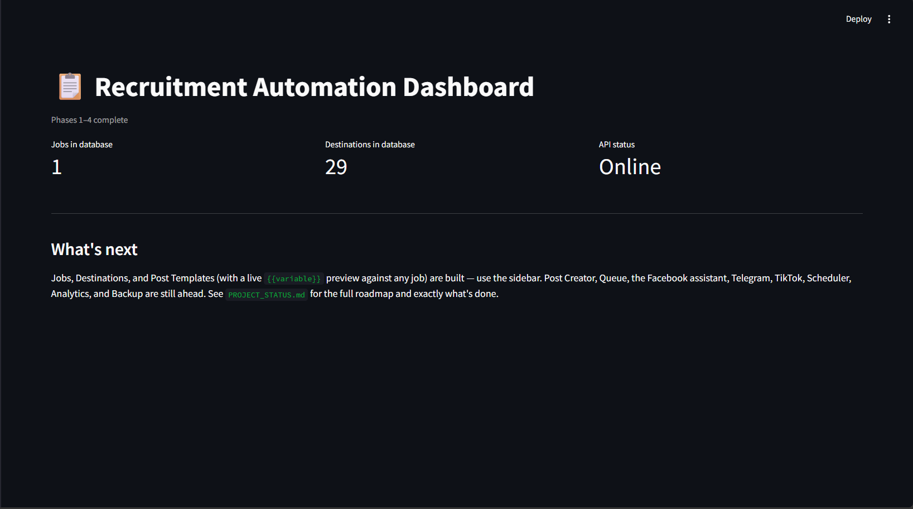
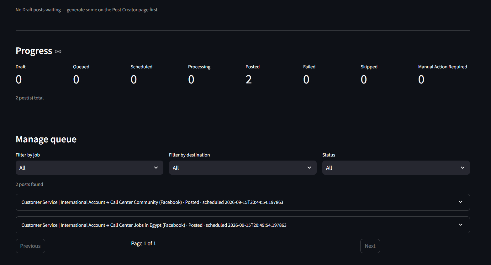
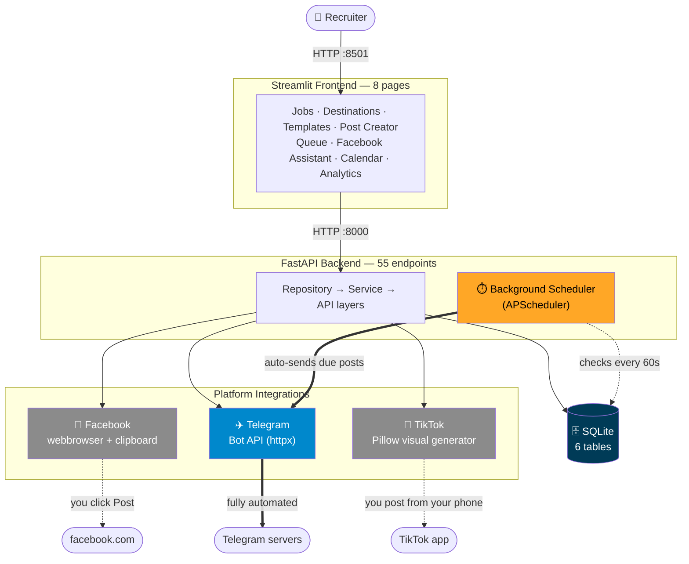
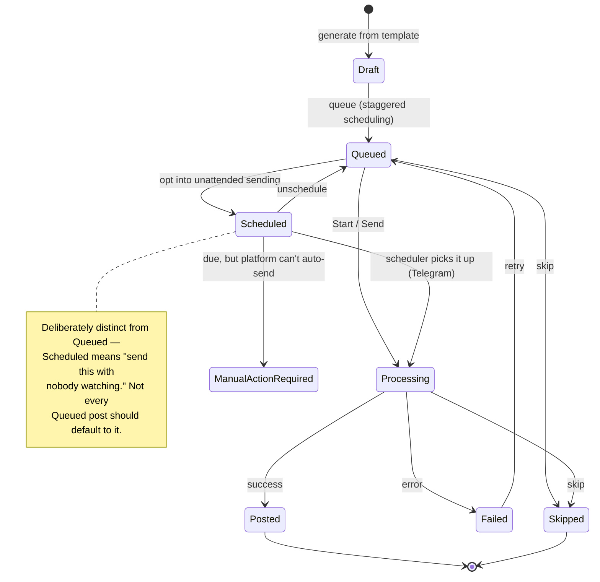

<div align="center">
    
# J-R-A-D  
## 📋 Jobs & Recruitment Automation Dashboard

**A locally-hosted tool that distributes job postings across Facebook, Telegram, and TikTok — automating what platforms actually let you automate, and honestly assisting with what they don't.**

[](https://www.python.org/)
[](https://fastapi.tiangolo.com/)
[](https://streamlit.io/)
[](docs/SETUP.md#running-tests)
[](#-what-it-costs)
[](docs/SETUP.md)

[Overview](#-overview) • [Features](#-features) • [Screenshots](#-screenshots) • [Architecture](#-architecture) • [Engineering Highlights](#-engineering-highlights) • [Getting Started](#-getting-started)

</div>

---

## 📖 Overview

A recruiter posting **50-100 job ads a day** across social platforms spends most of that time on repetitive, mechanical work: rewriting the same job for different audiences, copy-pasting into browser tabs, tracking what's been posted where. This project automates the parts that can honestly be automated, and builds a fast, guided workflow for the parts that can't — **without bypassing any platform's rate limits, terms of service, or bot detection.**

It's a full-stack local application: a **FastAPI** backend, a **Streamlit** frontend, a **SQLite** database, and three real platform integrations, built in 14 planned phases plus a round of post-launch polish. Everything in this README is real — the diagrams describe the actual code, the numbers come from actually running the test suite, and the "Engineering Highlights" section documents real bugs that were actually found and fixed, not a fabricated case study.

> **This is a portfolio/showcase README.** For exact installation steps, every page's full usage instructions, environment variables, and troubleshooting, see **[`docs/SETUP.md`](docs/SETUP.md)**. For the complete build history — every design decision and every bug, in the order they happened — see **[`PROJECT_STATUS.md`](PROJECT_STATUS.md)**.

---

## ✨ Features

| | Feature | What it does |
|---|---|---|
| 📋 | **Job Management** | Create, search, filter, close, and archive job postings |
| 🎯 | **Destinations** | Manage target groups/channels/accounts, with tags, categories, and CSV import/export |
| 📝 | **Templates** | 7 platform-tuned templates seeded automatically, with `{{variable}}` rendering and live preview |
| ✍️ | **Post Creator** | Generate posts (and tone variations) from a job + template combination, auto-selecting the right template per platform |
| 📬 | **Queue** | Batch-queue posts across many destinations with staggered scheduling, plus a one-click **"queue all"** for existing drafts |
| 🖱️ | **Facebook Assistant** | A guided, one-group-at-a-time workflow: opens the browser, copies the post to your clipboard, you click Post — with keyboard shortcuts |
| ✈️ | **Telegram** | Fully automatic sending via the official Bot API — one click, done |
| 🎵 | **TikTok Visuals** | Generates a recruitment graphic (Pillow) with **verified-correct Arabic right-to-left text** — see below |
| 🗓️ | **Scheduler + Calendar** | A background ticker that actually sends due Telegram posts unattended, and a week-at-a-glance calendar view |
| 📊 | **Analytics** | Manually-logged funnel metrics (views → clicks → applications → hires), broken down by destination and by template |
| 💾 | **Backup/Restore** | One-command database backups with automatic retention, and a safety-net backup taken before every restore |

---

## 🤖 What's Actually Automated (and What Isn't)

Not every platform lets you automate posting — and pretending otherwise is how projects end up violating terms of service or getting accounts banned. Here's the honest breakdown:

| Platform | Automation level | How it actually works |
|---|:---:|---|
| ✈️ **Telegram** | 🟢 **Fully automatic** | Real HTTPS calls to Telegram's official Bot API. One click sends the post and records the real outcome. |
| 📘 **Facebook** | 🟡 **Browser-assisted** | Facebook has no public API for group posting. The app opens the group in *your* logged-in browser and copies the text to your clipboard — you paste and click Post. Nothing scripts a click on Facebook's own page. |
| 🎵 **TikTok** | 🔴 **Manual, by design** | TikTok's real posting API requires an app audit most individual developers won't get quickly. The app generates the recruitment graphic; you post it from your phone. |

No CAPTCHA solving. No stealth automation. No bypassing rate limits. If a platform doesn't support something, the app tells you and gives you a fast manual path instead of faking it.

---

## 🖼️ Screenshots

### Real system output: the TikTok visual generator

These aren't mockups — they're the actual PNG files this project's `visual_generator.py` produces, generated fresh for this README.

<table>
<tr>
<td width="50%" align="center">

**English**


</td>
<td width="50%" align="center">

**Arabic (right-to-left)**


</td>
</tr>
</table>

The Arabic version is the harder engineering problem than it looks — see [Engineering Highlights](#-engineering-highlights) below for why Pillow's *automatic* Arabic text handling can't be trusted on Windows, and how this was actually verified rather than assumed.

<details>
<summary><b>📸 App screenshots — add your own here</b></summary>

<br>

This README was written in an environment that can't run a real Windows/browser session to capture the actual Streamlit UI. The app has 8 pages — after running it locally (see [Getting Started](#-getting-started)), drop screenshots into `docs/images/` and reference them here:

```markdown




```

Good ones to capture: the **Dashboard** (landing page), **Queue** (with a few posts in different statuses — Queued/Processing/Posted look good together), the **Facebook Assistant** mid-flow, and **Analytics** with a few metrics logged so the funnel chart isn't empty.

</details>

---

## 🏗️ Architecture



Solid arrows (`==>`) are fully automated; dashed arrows (`-.->`) are the human-in-the-loop steps — deliberately, not as a limitation.

## 🔄 Post Lifecycle

Every post moves through the same state machine regardless of platform — this is the actual `PostStatus` enum, not a simplification:



`Queued` and `Scheduled` look similar but mean different things on purpose — a Queued post still wants a human to trigger it (or a one-click Send); Scheduled is an explicit opt-in to fully unattended sending. Collapsing the two would have been simpler and was deliberately rejected — see `PROJECT_STATUS.md` for the reasoning.

---

## 🧰 Tech Stack

<div align="center">

| Layer | Technology |
|---|---|
| **Backend** |    |
| **Frontend** |  |
| **Database** |   |
| **Scheduling** |  |
| **Imaging** |  `arabic-reshaper` `python-bidi` |
| **Integrations** |  (Telegram Bot API) · `webbrowser` + `pyperclip` (Facebook) |
| **Testing** |  |

</div>

---

## 🔍 Engineering Highlights

Anyone can list features. What's more interesting is what went wrong along the way and how it got caught — every one of these is a real bug, found by actually running the code, not a hypothetical.

<details>
<summary><b>🔤 Arabic text was rendering broken on the one platform that matters — and it looked fine in testing</b></summary>

<br>

Pillow can render right-to-left Arabic script automatically via a layout engine called **raqm** — contextual letter joining, correct reading direction, all handled for you. It worked perfectly in this dev environment on the first try.

The problem: **raqm depends on a system library (`libfribidi`) that Pillow's official Windows wheels don't bundle** — confirmed against a real GitHub issue, not assumed. This dev environment happened to have it (Linux); the actual deployment target (Windows) does not.

The fix required *proving* the failure first: forcing Pillow's non-raqm layout engine and rendering the same Arabic string two ways side by side.

| Without the fix (Windows' real behavior) | With the fix |
|:---:|:---:|
| Disconnected letters, reversed reading order | Correctly shaped and ordered |

The real fix: manually reshape (`arabic_reshaper`) and bidi-reorder (`python-bidi`) Arabic text before drawing, and force the same non-raqm layout engine everywhere — so behavior is identical on every machine instead of silently depending on what happens to be installed.

</details>

<details>
<summary><b>🔐 A dependency was leaking a bot token into the log file — and it had nothing to do with this project's own code</b></summary>

<br>

`httpx` logs every request's full URL at INFO level by default. Telegram's Bot API embeds the bot token directly in the URL (`.../bot{token}/sendMessage`). Nothing in this project's code ever logged a token directly — but `httpx`'s *own* internal logging inherited the app's log level, and quietly wrote every token straight into `logs/app.log` in plain text.

Confirmed with a real (fake) token before the fix — it showed up in the log file. Fixed by explicitly setting `httpx`/`httpcore`'s loggers to `WARNING`. Confirmed again afterward that it was gone. A regression test was added later specifically because this fix initially shipped with **zero automated coverage** — caught during a dedicated hardening pass, and verified by temporarily reverting the fix and confirming the test actually failed before trusting it.

</details>

<details>
<summary><b>💾 The backup tool could silently overwrite the exact backup you were trying to restore</b></summary>

<br>

`restore()` takes a safety backup of the *current* database before overwriting anything — a good idea that turned into a real bug: backup filenames only had second-level precision, so a safety backup taken within the same second as an earlier manual backup landed on the **identical filename**, silently replacing the very file being restored from with the current (pre-restore) state.

Found by testing the restore flow end-to-end, not by inspecting the timestamp format. Fixed so a backup filename collision is now structurally impossible — a numeric suffix is appended whenever a naming collision would occur — rather than just "less likely."

</details>

<details>
<summary><b>📊 Two different posts on the same day were silently overwriting each other's analytics</b></summary>

<br>

Metrics are logged manually and "upserted" by (job, destination, date) — resubmitting today's numbers should update, not duplicate. But a destination can reasonably have *two* posts on the same day (two tone variations, a retry after a skip), and the original upsert key didn't account for that: logging metrics for a second post on the same day silently overwrote the first post's numbers, including erasing which post they belonged to.

Found via a real end-to-end test with two actual generated posts. Fixed by adding the specific post's ID to the upsert key.

</details>

---

## 🧪 Testing

**205 tests, all passing** — repository, service, and API layers for every feature, plus real (unmocked) file-generation tests for the image generator and backup/restore scripts.

| Test file | Count | What it covers |
|---|:---:|---|
| `test_posts.py` | 75 | Post generation, Queue, Facebook Assistant, Telegram, TikTok, Scheduler |
| `test_analytics.py` | 21 | Metrics logging, funnel/destination/template aggregation |
| `test_templates.py` | 23 | Template rendering, preview, CRUD |
| `test_destinations.py` | 20 | Destinations, tags, CSV import/export |
| `test_jobs.py` | 16 | Job CRUD, search, archive |
| `test_tiktok_visual.py` | 11 | Real Pillow image generation, Arabic reshape/bidi |
| `test_telegram_bot.py` | 11 | Every real Telegram Bot API failure shape (401/403/429/timeout/malformed) |
| `test_backup_restore.py` | 9 | Real file I/O, including the collision regression above |
| `test_scheduler.py` | 7 | Due-post logic, fully decoupled from APScheduler's own timer |
| `test_foundation.py` | 6 | Settings, schema, health check, the logging-fix regression above |

Run them yourself:

```bash
pytest -q
```

---

## 🚀 Getting Started

```bash
git clone <your-repo-url>
cd recruitment-automation
setup.bat   # Windows: creates a venv, installs dependencies, initializes the database
run.bat     # starts both servers and opens the dashboard
```

That's it — no Docker, no cloud account, no API keys required to start (Telegram needs a free bot token from [@BotFather](https://t.me/BotFather) if you want automatic sending).

**Full instructions, every environment variable, and troubleshooting: [`docs/SETUP.md`](docs/SETUP.md).**

---

## 💰 What It Costs

**$0**, verified feature by feature — not just asserted:

| Feature | Cost | Why |
|---|:---:|---|
| Core app (Jobs, Destinations, Templates, Queue, Scheduler, Calendar) | $0 | Runs entirely on your own machine — SQLite + FastAPI + Streamlit |
| Facebook | $0 | Your own logged-in browser session, no API, no ad spend |
| Telegram | $0 | The Bot API has no paid tier |
| TikTok | $0 | Local image generation + manual posting from your own account |
| Analytics, Backup/Restore | $0 | Local storage and local file copies |

The only place a real ongoing cost *could* enter is an optional, never-built AI-assisted content feature — entirely opt-in, not required for anything above.

---

## 📈 Project Stats

<div align="center">

| | |
|---|:---:|
| **Phases planned & completed** | 14 / 14 |
| **Lines of application code** | ~6,000 |
| **Lines of test code** | ~3,700 |
| **API endpoints** | 55 |
| **Database tables** | 6 |
| **Automated tests** | 205 |
| **Real bugs found & fixed during development** | 5 |
| **Platforms integrated** | 3 |
| **Ongoing cost to run** | $0 |

</div>

---

## 🗺️ Roadmap

Everything in the original 14-phase plan is complete. These are genuine ideas for going further — not unfinished work:

- [ ] **TikTok Content Posting API** — needs real app-audit approval from TikTok plus new OAuth token-storage schema
- [ ] **AI-assisted post rewriting/translation** — settings for this exist but nothing uses them yet
- [ ] **Multi-user / remote access** — would need real authentication first; this is a local, single-user tool by design today
- [ ] **Automatic scheduled backups** — currently manual (`backup.bat`) by design; Windows Task Scheduler is the low-effort path if wanted

See [`PROJECT_STATUS.md`](PROJECT_STATUS.md) for the full reasoning behind each.

---

## 📄 License

_Add a license here before publishing — [MIT](https://choosealicense.com/licenses/mit/) is a common choice for portfolio projects if you're not sure._

---

<div align="center">

Built phase by phase, with a real test suite and a real bug list — not a demo.

</div>
